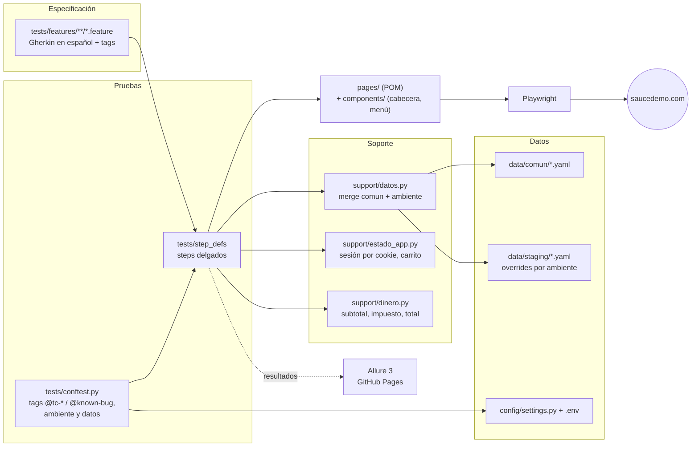

# Test-frontend-QA-Cod · Automatización E2E de SauceDemo

[](https://github.com/DannyDan2016/Test-frontend-QA-Cod/actions/workflows/ci.yml)
[](https://dannydan2016.github.io/Test-frontend-QA-Cod/)
[](LICENSE)


Suite de pruebas de UI para [SauceDemo (Swag Labs)](https://www.saucedemo.com), una tienda de demostración pública. Está escrita en **BDD con Gherkin en español** sobre **pytest-bdd + Playwright**, con datos y valores esperados en YAML por ambiente, ejecución en paralelo y en tres navegadores dentro de Docker, y un reporte **Allure 3** publicado en GitHub Pages.

No pretende cubrir todo el sitio: es una **muestra curada de 12 escenarios (23 ejecuciones)**, elegidos por riesgo y por técnica sobre un inventario de 110 casos. El criterio de selección, la trazabilidad y los bugs reales que se encontraron están en [`docs/estrategia-de-pruebas.md`](docs/estrategia-de-pruebas.md).

## Lo más destacado

- **Gherkin ejecutable en español** (`# language: es`), con escenarios declarativos y steps delgados.
- **Page Object Model estricto**: los page objects exponen locators y acciones; las verificaciones van en los steps. Componentes compartidos (cabecera, menú) y selectores estables (`data-test`, roles accesibles).
- **Cero literales de negocio en el código**: usuarios, mensajes, productos, precios, tasa de impuesto y umbrales viven en `data/comun/*.yaml`, con overrides por ambiente en `data/<env>/`. Los importes del checkout se **calculan** a partir de los precios y la tasa, no se copian.
- **Cero esperas fijas**: assertions web-first y, para el spinner de duración aleatoria, el reloj del navegador controlado con `page.clock`.
- **Bugs reales como xfail estricto**: el escenario afirma el comportamiento correcto, y si Sauce Labs lo corrige, el XPASS rompe el build.
- **Trazabilidad**: cada escenario lleva su `@tc-AREA-NNN` del inventario y se puede filtrar con `pytest -k TC-AUTH-001`.
- **Precondiciones rápidas**: la sesión se crea con la cookie de la app y el carrito vía `localStorage`. Solo los escenarios de login y el E2E pasan por la UI.
- **CI en Docker**: chromium completo y smoke en Firefox y WebKit en cada PR, regresión nocturna en los tres navegadores y Allure 3 en Pages.

## Stack

| Pieza | Versión | Para qué |
|---|---|---|
| Python | 3.12 | lenguaje |
| Playwright (sync API) | 1.63.0 | automatización del navegador |
| pytest | 9.1.1 | runner |
| pytest-playwright | 0.9.0 | fixtures de navegador, artefactos de fallos |
| pytest-bdd | 9.0.0 | Gherkin en español |
| pytest-xdist | 3.8.0 | ejecución en paralelo |
| allure-pytest-bdd · Allure 3 | 2.16.2 · 3.19.1 | resultados y reporte |
| PyYAML · python-dotenv | 6.0.3 · 1.2.3 | datos por ambiente y configuración |
| ruff | 0.16.9 | linter y formatter |
| Docker | `mcr.microsoft.com/playwright/python:v1.63.0-noble` | ejecución reproducible (local y CI) |

## Arquitectura



En CI, GitHub Actions construye la imagen con `docker compose` y ejecuta dentro `ci/ejecutar_suite.sh`, que lanza la suite en paralelo y después los escenarios `@performance` en serie. Al final, el job de reporte combina los resultados de los tres navegadores en un único Allure 3.

## Estructura

```text
.
├── .github/
│   ├── workflows/ci.yml          # lint, matriz de navegadores, Allure 3 y Pages
│   ├── dependabot.yml
│   └── pull_request_template.md
├── ci/
│   ├── ejecutar_suite.sh         # paralelo + @performance en serie (CI, Jenkins y Docker)
│   └── jenkins/Jenkinsfile       # alternativa on-premise
├── config/settings.py            # ambientes (prod, staging) y precedencia de configuración
├── data/
│   ├── comun/*.yaml              # datos y valores esperados compartidos
│   └── staging/*.yaml            # overrides de ejemplo (merge profundo)
├── docs/estrategia-de-pruebas.md
├── pages/                        # page objects (inglés: convención de Playwright)
│   ├── components/               # Header y Menu compartidos
│   └── dynamic_catalog/          # Dynamic Catalog (spinner)
├── support/                      # datos YAML, sesión, importes y aserciones reutilizables
├── tests/
│   ├── conftest.py               # --env, datos y tags de Gherkin -> marcas
│   ├── features/                 # .feature en español, una carpeta por área
│   ├── step_defs/                # un módulo de steps por área + conftest con los compartidos
│   └── unit/                     # tests del cargador YAML y del cálculo de importes
├── Dockerfile · docker-compose.yml
├── pytest.ini · ruff.toml
└── requirements.txt · requirements-dev.txt · .env.example
```

## Ejecución local

Requisitos: Python 3.12 y Git.

```bash
git clone https://github.com/DannyDan2016/Test-frontend-QA-Cod.git
cd Test-frontend-QA-Cod
python -m venv .venv
source .venv/bin/activate          # Windows (PowerShell): .venv\Scripts\Activate.ps1
pip install -r requirements-dev.txt
playwright install chromium
```

El `.env` es opcional: sin él se usan los valores por defecto (ambiente `prod` y la contraseña pública de SauceDemo).

```bash
cp .env.example .env
```

| Comando | Qué ejecuta |
|---|---|
| `pytest` | suite completa en serie (Chromium) |
| `pytest -m smoke` | camino crítico |
| `pytest -n auto` | en paralelo; los `@performance` se omiten con su motivo |
| `pytest -m performance` | mediciones de rendimiento (siempre en serie) |
| `pytest -m "negative and not known_bug"` | solo los negativos |
| `pytest -m known_bug -rx` | bugs conocidos con su motivo |
| `pytest -k TC-AUTH-001` | un caso por su ID de inventario |
| `pytest --headed --slowmo 500 -k TC-E2E-001` | ver el navegador |
| `pytest --env staging` | otro ambiente (datos de `data/staging`) |
| `bash ci/ejecutar_suite.sh chromium smoke` | igual que la CI: paralelo + `@performance` en serie |
| `ruff check . && ruff format --check .` | lint y formato |

Otros navegadores: `playwright install firefox webkit` y después `pytest --browser firefox -m smoke`.

## Ejecución en Docker

La imagen oficial de Playwright ya trae los tres navegadores, así que no hace falta instalar nada en la máquina.

```bash
docker compose build
docker compose run --rm ui-tests                                   # suite completa (Chromium)
docker compose run --rm ui-tests bash ci/ejecutar_suite.sh firefox smoke
docker compose run --rm ui-tests pytest -k TC-AUTH-001
```

Los resultados quedan en el host, en `./reports` (Allure) y `./test-results` (trace, vídeo y captura de los fallos). En Linux, esos directorios deben ser escribibles por el uid 1000 (`pwuser`).

## CI/CD

El workflow [`ci.yml`](.github/workflows/ci.yml) ejecuta todo dentro de la imagen Docker del repo:

| Disparador | Chromium | Firefox / WebKit | Reporte |
|---|---|---|---|
| Pull request | suite completa | `@smoke` | artefacto `allure-report` |
| Push a `main` | suite completa | `@smoke` | artefacto + [GitHub Pages](https://dannydan2016.github.io/Test-frontend-QA-Cod/) |
| Nightly (04:00 UTC) | suite completa | suite completa | artefacto + GitHub Pages |
| Manual (`workflow_dispatch`) | `-m` del input `marcadores` | `-m` del input | artefacto (+ Pages en `main`) |

El nightly detecta cambios en el sitio aunque nadie toque el repo; por ejemplo, un XPASS cuando Sauce Labs arregla un `@known-bug`. Hay un pipeline equivalente para Jenkins en [`ci/jenkins/Jenkinsfile`](ci/jenkins/Jenkinsfile).

## Multiambiente y datos

- El ambiente se elige con `TEST_ENV` (en `.env` o en el entorno) o con `pytest --env <nombre>`. Los ambientes están en `config/settings.py`. Como SauceDemo solo publica producción, `staging` es un **ejemplo** que apunta a la misma URL y demuestra los overrides.
- Cada YAML de `data/comun/` se fusiona en profundidad con su homónimo de `data/<env>/`, si existe, y gana el ambiente. Por ejemplo, `data/staging/rendimiento.yaml` solo redefine el umbral.
- Los strings admiten `${VAR}` y `${VAR:-defecto}`: la contraseña se lee de `SAUCE_PASSWORD`.
- Los steps referencian claves (`datos("checkout.cliente_valido")`). Si falta una clave, el error indica el archivo, la clave que falta y las disponibles.
- Precedencia de la URL: `--base-url` > `BASE_URL` (entorno o `.env`) > URL del ambiente.

## Tags

| Tag | Uso |
|---|---|
| `@smoke` | camino crítico: en cada PR y en los tres navegadores |
| `@regression` | resto de la muestra |
| `@negative` | validaciones y casos de error |
| `@performance` | mide tiempos; en serie (con `-n` se omite con motivo) |
| `@known-bug` | bug real del sitio → `xfail(strict=True)` con el motivo de `data/comun/bugs.yaml` |
| `@tc-area-nnn` | ID del inventario (`TC-AREA-NNN`), filtrable con `-k` |

Todas las tags están declaradas en `pytest.ini` y se ejecuta con `--strict-markers`: una tag mal escrita aborta la recolección.

## Reporte

Cada ejecución deja resultados de Allure en `reports/allure-results` (y en `reports/allure-results-rendimiento` la fase en serie). Para generar y abrir el reporte Allure 3 en local hace falta Node.js:

```bash
npx --yes allure@3.19.1 generate reports/allure-results --output allure-report
npx --yes allure@3.19.1 open allure-report
```

El reporte de `main` se publica en **https://dannydan2016.github.io/Test-frontend-QA-Cod/**. Cada escenario lleva el navegador como parámetro, sus steps, el tiempo medido en los de rendimiento y una captura si falla.

## Limitaciones conocidas

- SauceDemo es un sitio público de terceros: puede cambiar sin aviso o fallar de forma intermitente, y por eso existe el nightly. Las rutas internas responden HTTP 404 aunque la SPA las renderiza bien, así que no se valida el código de respuesta.
- La medición de rendimiento depende de la máquina. Con 12 navegadores en paralelo se midieron 11-16 s frente a 5,15 s en serie, y por eso `@performance` siempre corre en serie.
- En local solo se ha verificado Chromium; Firefox y WebKit se ejecutan en la CI.
- No hay pruebas visuales por píxeles: Playwright para Python no trae `to_have_screenshot`.
- El reporte de Pages no conserva el histórico entre ejecuciones (ver sugerencias en la estrategia).
- Es una muestra curada (17 de los 110 casos del inventario, con algunos parciales). La cobertura completa está planificada en la estrategia.

## Contribuir

Las convenciones de POM, YAML, tags y commits están en [CONTRIBUTING.md](CONTRIBUTING.md).

## Autor

**Danny Parrado**: QA Automation Engineer · [GitHub @DannyDan2016](https://github.com/DannyDan2016)

Licencia [MIT](LICENSE).
